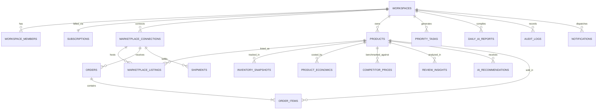

# EcomPilot Database Entity Relationship Diagram (ERD)

```mermaid
erDiagram
    WORKSPACES ||--o{ WORKSPACE_MEMBERS : has
    WORKSPACES ||--|| SUBSCRIPTIONS : billed_via
    WORKSPACES ||--o{ MARKETPLACE_CONNECTIONS : connects
    WORKSPACES ||--o{ PRODUCTS : owns
    WORKSPACES ||--o{ PRIORITY_TASKS : generates
    WORKSPACES ||--o{ DAILY_AI_REPORTS : compiles
    WORKSPACES ||--o{ AUDIT_LOGS : records
    WORKSPACES ||--o{ NOTIFICATIONS : dispatches

    PRODUCTS ||--o{ MARKETPLACE_LISTINGS : listed_as
    PRODUCTS ||--o{ INVENTORY_SNAPSHOTS : tracked_in
    PRODUCTS ||--o{ PRODUCT_ECONOMICS : costed_by
    PRODUCTS ||--o{ COMPETITOR_PRICES : benchmarked_against
    PRODUCTS ||--o{ REVIEW_INSIGHTS : analyzed_in
    PRODUCTS ||--o{ AI_RECOMMENDATIONS : receives

    MARKETPLACE_CONNECTIONS ||--o{ MARKETPLACE_LISTINGS : hosts
    MARKETPLACE_CONNECTIONS ||--o{ ORDERS : receives
    MARKETPLACE_CONNECTIONS ||--o{ SHIPMENTS : fulfills

    ORDERS ||--|{ ORDER_ITEMS : contains
    PRODUCTS ||--o{ ORDER_ITEMS : sold_in
```
